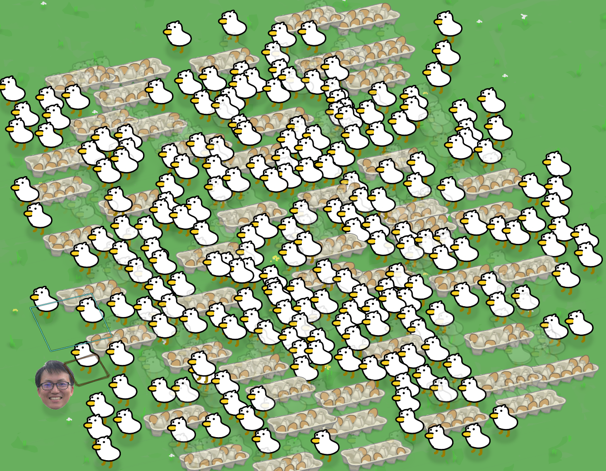

# ya-ya

## 鴨鴨

### roadmap

#### gameplay

- [ ] add on hold item menu ui
- [x] add map tiles and rendering
- [x] add map collision
- [ ] add building mechanism and ui
- [ ] selling and buying resources

#### serialization

- [x] save duck gender
- [ ] save actions
- [ ] ...

#### artwork

- [ ] half?

### build guide

**Compiler:** `mingw64 x86_64-12.1.0-release-posix-seh-rt_v10-rev3`

**Working directory:** `/build/`

**SFML version:** `2.6.x` (fetched from GitHub)

### controls

- when hands are empty
    - ✅ `PICK_UP_ITEM` ~~<mouse_button> pick up item~~
    - ❌ shows very basic information
    - ❌ if an item with actions is highlighted...
        - a tool
            - \<alt> equip tool (and unequip tool)
    - if facing a container...
        - ✅ `PICK_UP_ITEM_FROM_CONTAINER`
- when holding an entity
    - ✅ `DROP_ITEM` ~~<mouse_button> drop item~~
    - ~~if a container is highlighted (for example an egg carton)~~
        - ✅ `STORE_ITEM_TO_CONTAINER` ~~\<alt> store item~~
    - if a ❌(container space) is highlighted (for example a cage)
        - ❌ \<alt> store item
- when holding a container
    - <mouse_button> drop container
    - if a storable item is highlighted (game field)
        - \<alt> store item
    - if an inventory item is highlighted (bottom bar)
        - if offhand is empty
            - <other_mouse_button> pick up item
            - <this_mouse_button> drop item
        - else
            - "free your other hand to manipulate inventory"
    - if an empty slot is highlighted (bottom bar)
        - if offhand is holding a storable item
            - <other_mouse_button> store item
        - else if offhand is holding a instorable item
            - "xx can not be stored in this container"
        - else
            - nothing
    - shows contents on bottom bar
    - (optional) items can be dragged around in the bottom bar (if offhand is empty, or else show "free your other hand to manipulate inventory")
- when holding a tool...
    - <mouse_button> unequip tool
    - hammer(?) (the building tool)
        - if a building is highlighted
            - <alt + hold> demolish (turns into item form with a chance of disappearing)
        - if the other hand is holding a buildable item and a valid tile is highlighted
            - \<alt> build
    - ...
- (optional) when holding food
    - if an entity is highlighted
        - \<alt> feed
